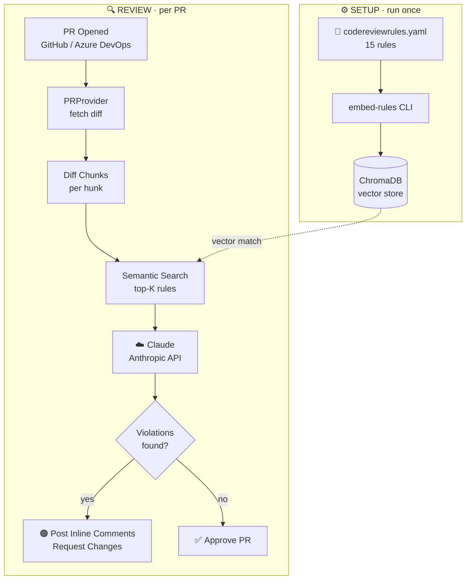

# Hi, I'm Kamlesh

Engineering leader, architect, and builder — 20+ years designing distributed systems, shipping full-stack products, leading global teams, and occasionally open-sourcing the tools I wish had existed sooner.

---

## Open Source — The Lazarus Ecosystem

### Why Lazarus?

In a large microservices platform, failures are inevitable. A downstream service times out. A database blips under load. A third-party API returns 503.

`@Retryable` and Spring Retry handle the in-process retries well — but they have a hard limit: they retry synchronously, in the same thread, within the same request lifecycle. When all retries are exhausted, the exception propagates and the payload is gone forever. No record of what failed. No way to reprocess it after the fix goes in. No visibility for the ops team.

I kept running into this in production. Business events vanishing silently. On-call engineers with no way to answer "what exactly failed, and with what data?" So I built Lazarus — a Spring Boot library that treats failures as durable events, not transient noise.

**The name?** Lazarus raises the dead. So does the library.

```java
@Lazarus(
    retryOn = { TransientDataException.class, TimeoutException.class },
    backoff = @LazarusBackoff(initialDelay = 500, multiplier = 2, maxDelay = 8000),
    retryLimit = 3,
    reprocessVia = ReprocessingStrategy.KAFKA,
    topic = "lazarus.reprocess.orders"
)
public void processOrder(@LazarusPayload OrderRequest order) {
    // Just write the happy path — Lazarus handles the rest
}
```

| Repo | What it does |
|---|---|
| [lazarus-lib](https://github.com/byte-by-k/lazarus-lib) | Spring Boot AOP library — `@Lazarus` annotation, exponential backoff, payload persistence |
| [lazarus-mcp](https://github.com/byte-by-k/lazarus-mcp) | MCP Server — exposes the Lazarus DB as AI-queryable tools (list_events, retry_batch, …) |
| [mcp-agent-java](https://github.com/byte-by-k/mcp-agent-java) | Java AI agent (Spring AI / LangChain4j) that talks to lazarus-mcp |
| [mcp-agent-python](https://github.com/byte-by-k/mcp-agent-python) | Python AI agent (Anthropic SDK / LangChain) that talks to lazarus-mcp |

---

## AI & Agent Engineering

These are personal POCs — AI agents built to solve real engineering problems I've run into, not toy examples.

### [ai-pr-reviewer](https://github.com/byte-by-k/ai-pr-reviewer)

An AI-powered, DevOps-agnostic pull request reviewer. Define your rules in YAML, embed them in ChromaDB, and let Claude semantically match rules to each diff chunk — posting actionable inline comments directly on the PR.



| Repo | What it does |
|---|---|
| [ai-pr-reviewer](https://github.com/byte-by-k/ai-pr-reviewer) | RAG pipeline (ChromaDB + Claude) that enforces custom code review rules on Azure DevOps & GitHub PRs |

---

*Building things that don't fall apart quietly.*
